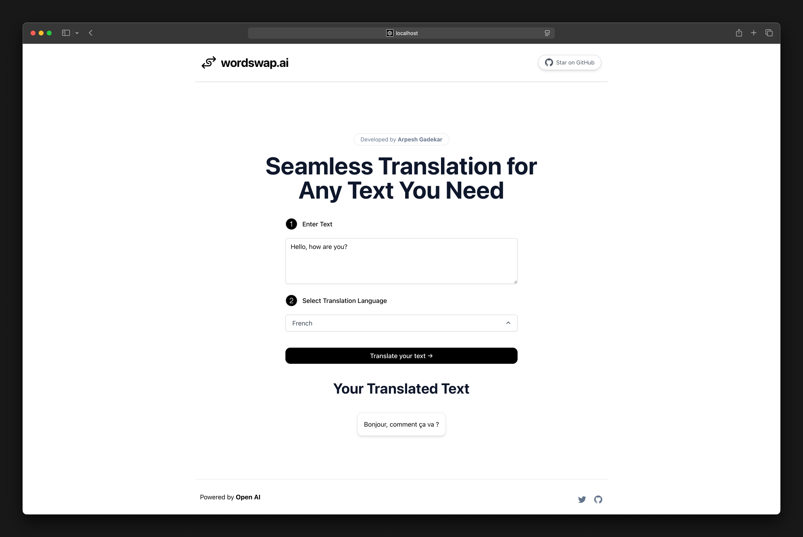
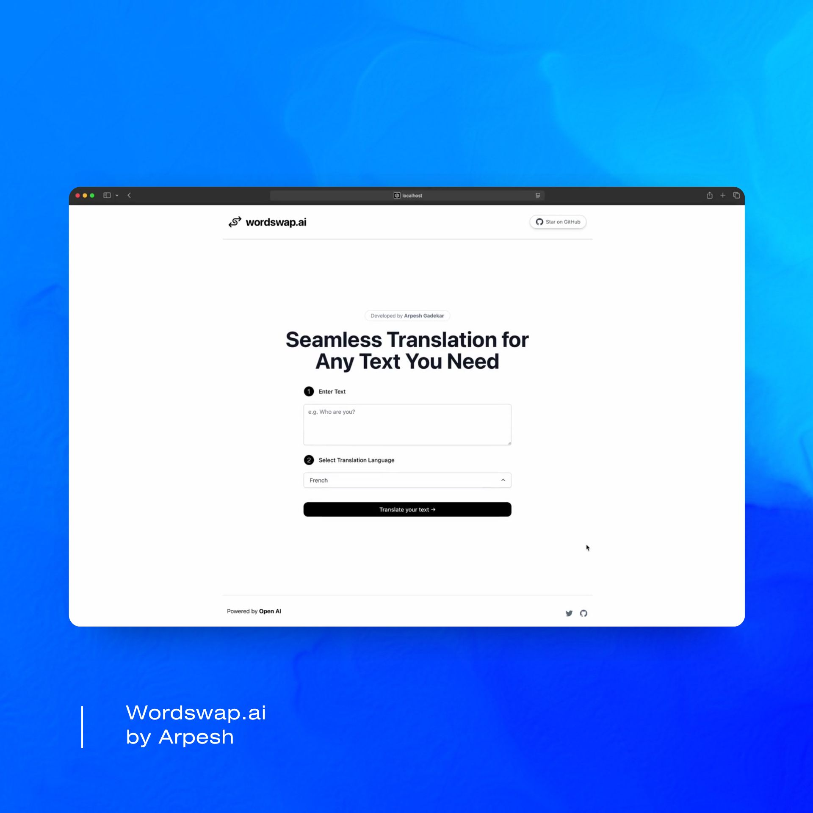

# WordSwap.ai

WordSwap.ai is a simple language translator web application built with **Next.js** and **OpenAI's API** This app allows users to translate text into different languages using OpenAI's language models.

---

## Features

- Translate text to various languages.
- Responsive and user-friendly interface.
- Powered by OpenAI's GPT model.

---

## Technologies Used

- **Next.js**: Framework for server-side rendering and React-based web apps.
- **OpenAI API**: For language translation and processing.
- **Tailwind CSS**: For styling the frontend.

---

## Installation

1. Clone the repository:
   ```bash
   git clone https://github.com/arpesh28/wordswap.ai.git
   ```
2. Navigate to the project directory:
   ```bash
   cd wordswap.ai
   ```
3. Install dependencies:
   ```bash
   npm i
   ```
4. Create a `.env` file in the root directory and add your OpenAI API key:

   ```env
   OPENAI_API_KEY=your_openai_api_key
   ```

5. Start the development server:

   ```bash
   npm run dev
   ```

6. Open the app in your browser:
   ```
   http://localhost:3000
   ```

---

## Usage

1. Enter the text you want to translate in the input box.
2. Specify the target language (e.g., French, Spanish, Japanese).
3. Click on the "Translate" button.
4. View the translated text.

---

## Demo



[](https://www.youtube.com/shorts/huSIXQQyTNM)

---

## Future Improvements

- Add language detection for the input text.
- Implement a dropdown menu for source language selection.
- Improve error handling and loading indicators.
- Add support for speech-to-text and text-to-speech.

---

## Contributing

Contributions are welcome! Please follow these steps:

1. Fork the repository.
2. Create a new branch:
   ```bash
   git checkout -b feature-name
   ```
3. Commit your changes:
   ```bash
   git commit -m "Add feature-name"
   ```
4. Push to the branch:
   ```bash
   git push origin feature-name
   ```
5. Open a pull request.

---

## Acknowledgments

- [OpenAI](https://openai.com) for the API.
- [Next.js](https://nextjs.org) for the awesome framework.
